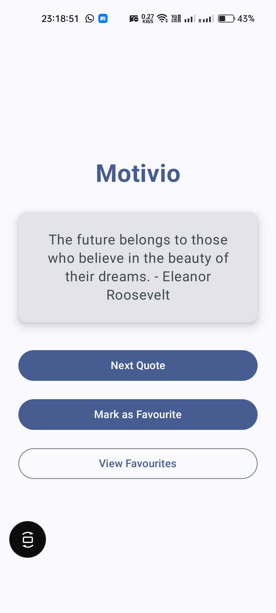
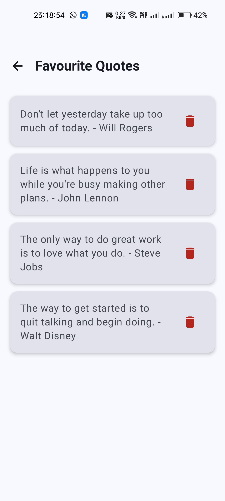

# Motivio - Motivational Quotes App

A simple Android app built with Kotlin and Jetpack Compose that displays inspirational quotes to keep you motivated throughout the day.

## Features

- Random motivational quotes display
- Save your favorite quotes
- View all saved favorites
- Clean and modern Material Design UI
- Persistent storage of favorites

## Screenshots

<div align="center">
  
  
</div>

### Demo Video
[📹 Watch App Demo](https://drive.google.com/file/d/1tuWaGoYVct0t26E3P1cc4_M8bzJ8gVJo/view?usp=sharing)

The app has two main screens:
- **Main Screen**: Shows a random quote with options to get next quote, save to favorites, or view favorites
- **Favorites Screen**: Displays all your saved quotes in a scrollable list

## How to Use

1. Open the app to see a random motivational quote
2. Tap "Next Quote" to see a different quote
3. Tap "Mark as Favourite" to save quotes you like
4. Tap "View Favourites" to see all your saved quotes
5. In favorites screen, tap the delete icon to remove quotes

## Tech Stack

- **Language**: Kotlin
- **UI Framework**: Jetpack Compose
- **Architecture**: MVVM pattern
- **Storage**: SharedPreferences for favorites
- **Navigation**: Navigation Compose

## Project Structure

```
app/src/main/java/com/app/motivio/
├── MainActivity.kt          # Main activity with navigation setup
├── MainScreen.kt           # Home screen with quote display
├── FavouritesScreen.kt     # Screen showing saved quotes
├── QuoteCard.kt            # Reusable quote card component
├── FavouritesManager.kt    # Handles saving/loading favorites
└── ui/theme/               # App theming and colors
```